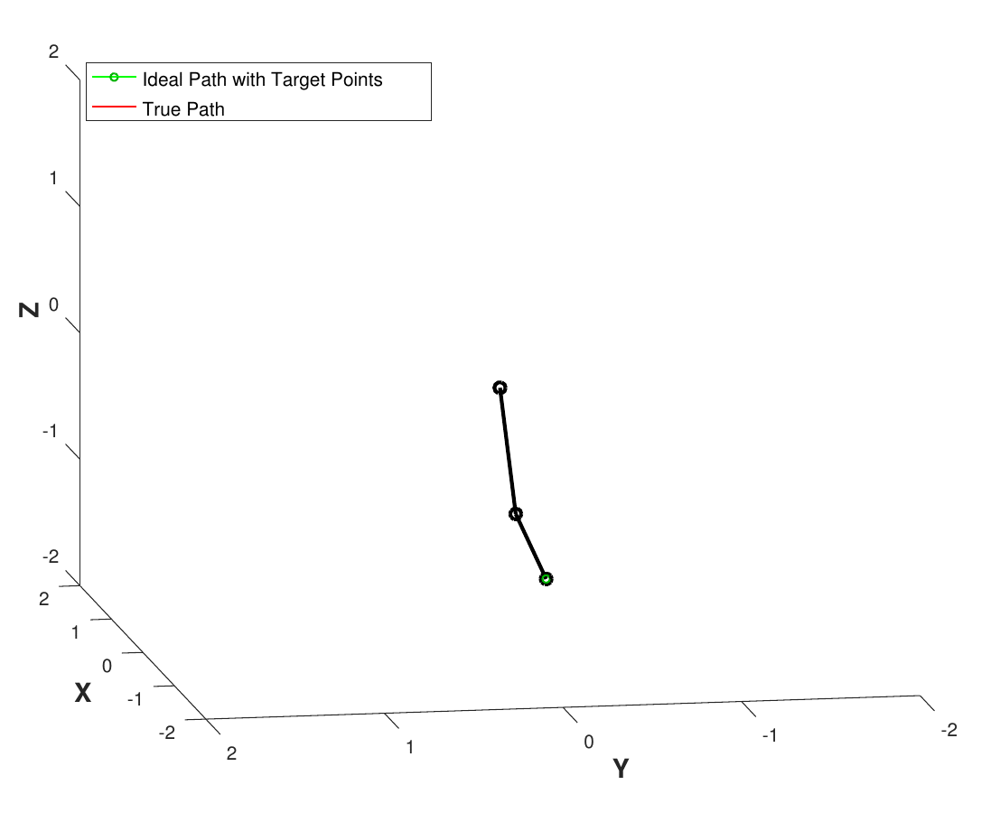
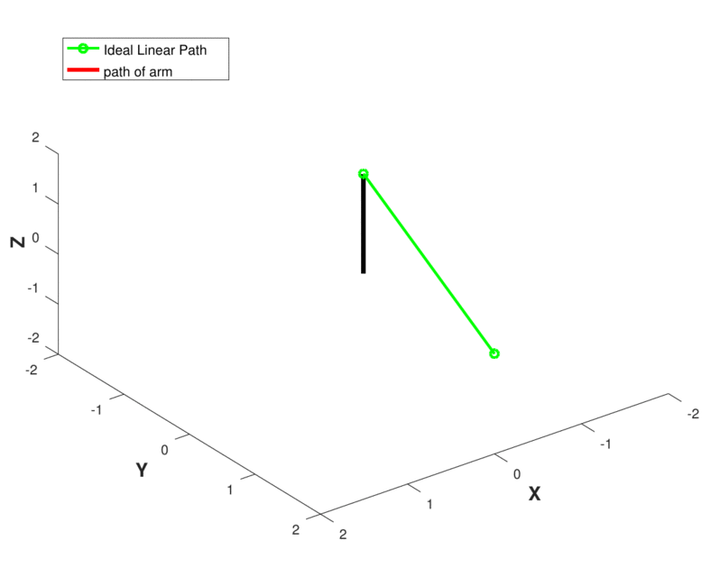
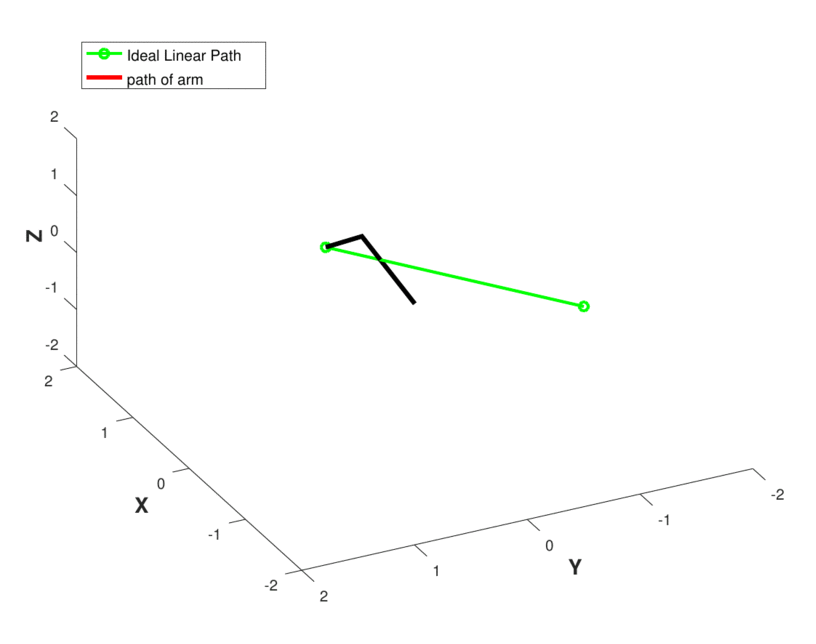

***MTE204_Robot_Arm_Control***
---------------------------------------------
This our a numerical methods project, where we were tasked with implementing and analyzing a numerical method of our choice. We chose to test the Jacobian transpose method, which a method used in the inverse kinematics of robotic arms. This simulation seeks to analyze this method on a virtual 3-DOF arm called Margaret, with the goal of setting up linear paths for Margaret's end effector to follow. An example of this with minimal target points is shown below. As you can see we had to linearlize the joint angle between each target point resulting is arcs.

The core implementation of our algorithm is based off of: https://www.math.ucsd.edu/~sbuss/ResearchWeb/ikmethods/iksurvey.pdf

The Major organization of the following files is as follows

Code Implementing the Jacobian Transpose Method and Model of Margaret:
----------------------------------------------
|File| Desc|
|--|--|
| Jacobian.m |Function that calculates the Jacobian of the robotic system |
|getQ.m | Function that use the Jacobian Transpose method to get the set of joint angles Q for your target position for the end effector |
|armFunction.m | Calculates the position of the end effector based on inputted joint angles |
|armFunction_midJoint.m|Calculates the positions of the midjoint (elbow) of the arm|
|JacobianConvergence.m|Prints out the end effector at each iteration of the transpose method, to visualize converging and diverging cases|
|JacobianConergenceSim.m|Continuous simulation of the above, looks nicer but runs on a deliberate delay, so is slower|
|JacobianConergenceSimGif.m|Outputs the simulation as a multipage pdf which can be spliced into a gif|

Code Implementing Pathing To Target Point
--------------------------------------------
|File|Desc|
|--|--|
|Pathing.m| Plots the linear path, and compares it to the linearization of the joint angles, resulting in arcs|
|PathingSim.m | Simulates the above but ALSO has user input to find the optimal number of sub-intervals to break the path into, based on our analysis|
|PathingSimGif.m |Outputs the simulation as a multipage pdf which can be spliced into a gif|
|sectionPath.m |Function that sections a given linear path into n sub intervals and returns all the target points|

Analysis of Time Complexity
--------------------------------------
|File|Desc|
|--|--|
|ExTimeVsSubintervals.m | uses timeoutputtest.m to calculate the time for each sub-interval value|
|TimeOutputTest.m | similair to Pathing.m but doesn't have code for graph outputs, and instead has visualization to accurately evaluate the time complexity of the algorithm based on the cpu you run the algorithm on|

Other Fun Gif Examples
--------------------------------------
This one we've dubbed as the christmas tree! It's an odd singualrity within the transpose jacobian method, where whenever the arm is completely outstretched, a single iteration will swing the 'shoulder' angle of the robot from 0 to something around 10^23. The gif only plots out in straight lines because we have broken the true path into finite steps for the sake of simplicity, otherwise the arm would've swung aroung an uncountable amount of times, and likely crashed my computer. If interested the christmas case is commented out in PathingSim.m, play around with the parameters!

Here you can see essentailly the same diverging case of the jacobian method, but we dont attempt to create a linearized path between each target point, so you dont see the shoulder joint flip out.

And on the other end, a convergent case, where we are able to find the target joint angles within 30 iterations or so!

